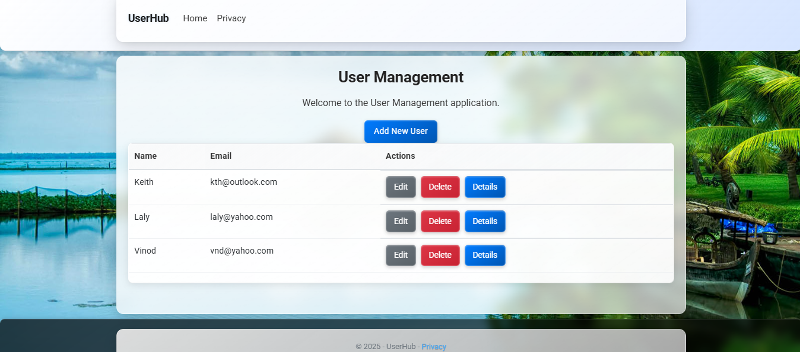

CRUD Application - ASP.NET Core
 This is a simple CRUD (Create, Read, Update, Delete) application built with ASP.NET Core Razor Pages, using SQL Server as the database. The app allows users to manage user records (Name and Email) with a clean, responsive interface.

 ## Features
 - **Create**: Add new users via a form.
 - **Read**: Display all users in a scrollable table.
 - **Update**: Edit existing user details.
 - **Delete**: Remove users from the database.
 - Responsive design with Bootstrap 4.5.2 and custom CSS.
 - SQL Server database (`CRUD_APP`) with Entity Framework Core.
 - Clean navigation bar and footer, with a semi-transparent content area.

 ## Screenshot
 Below is a screenshot of the application showing the user table with scrolling:

 

 ## Prerequisites
 - .NET 6.0 SDK
 - SQL Server Express (e.g., `JOHNSLENOVOZ50\SQLEXPRESS`)
 - Visual Studio 2019 or later (or VS Code with .NET CLI)
 - Git

 ## Setup Instructions
 1. **Clone the Repository**:
    ```bash
    git clone https://github.com/johnkoshy/CRUD-Application-ASP.NET-Core.git
    cd CRUD-Application-ASP.NET-Core
    ```
 2. **Restore Dependencies**:
    ```bash
    cd CRUD_APP
    dotnet restore
    ```
 3. **Configure Database**:
    - Ensure SQL Server Express is running.
    - Update the connection string in `appsettings.json` if needed:
      ```json
      "ConnectionStrings": {
        "CRUD_APPContext": "Server=JOHNSLENOVOZ50\\SQLEXPRESS;Database=CRUD_APP;Trusted_Connection=True;TrustServerCertificate=True;"
      }
      ```
 4. **Apply Migrations**:
    ```bash
    dotnet ef migrations add InitialCreate
    dotnet ef database update
    ```
 5. **Run the Application**:
    ```bash
    dotnet run
    ```
    - Open `https://localhost:5001` in your browser.
 6. **Test the App**:
    - Navigate to `https://localhost:5001/Create` to add users.
    - View the user table at `https://localhost:5001`.
    - Verify data in SQL Server Management Studio (SSMS):
      ```sql
      USE CRUD_APP;
      SELECT * FROM Users;
      ```

 ## Project Structure
 - `CRUD_APP.csproj`: Project file with dependencies.
 - `Pages/`: Razor Pages (`Index.cshtml`, `Create.cshtml`, etc.).
 - `wwwroot/css/site.css`: Custom styles for layout and responsive design.
 - `wwwroot/images/w.jpg`: Background image (optional).
 - `appsettings.json`: Configuration for database connection.
 - `docs/screenshot.png`: Screenshot for documentation.

 ## Technologies Used
 - ASP.NET Core 6.0
 - Entity Framework Core 6.0.35
 - SQL Server Express
 - Bootstrap 4.5.2
 - jQuery 3.5.1
 - Roboto font (Google Fonts)

 ## Notes
 - The app uses a semi-transparent container for content, with a compact navigation bar and footer.
 - The user table supports scrolling for more than three users, preventing footer overlap.
 - Ensure `wwwroot/images/w.jpg` exists for the background, or modify `site.css` to use a solid color.

 ## License
 MIT License. See [LICENSE](LICENSE) for details.

 ## Contact
 For issues or suggestions, open an issue on [GitHub](https://github.com/johnkoshy/CRUD-Application-ASP.NET-Core/issues).

